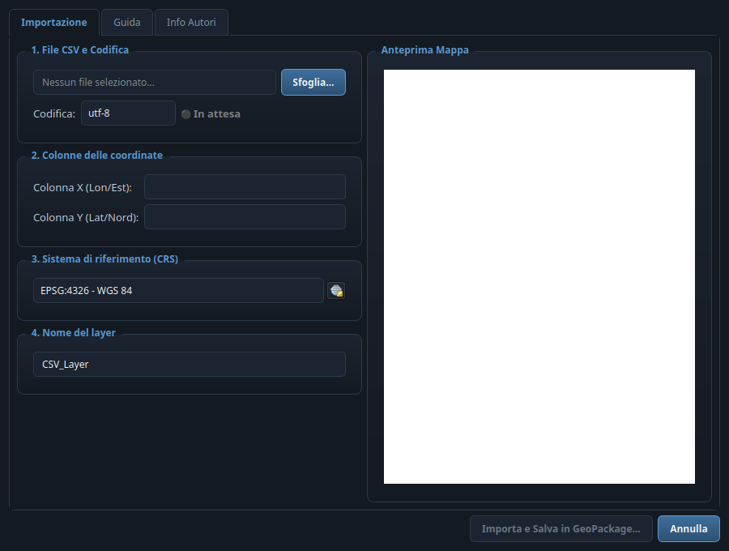
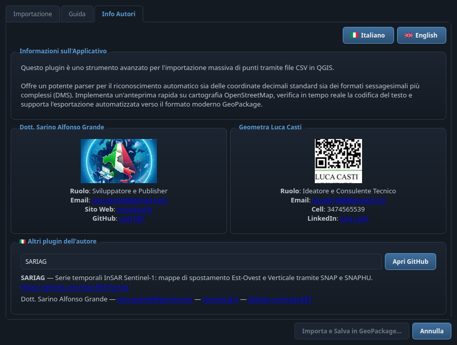

# 📍 GeoCSV Mapper for QGIS

> **IT** · Importa file CSV con coordinate in vari formati (decimali e sessagesimali **DMS**), con **anteprima immediata su OpenStreetMap**, verifica della codifica in tempo reale e salvataggio diretto in **GeoPackage**.
>
> **EN** · Imports CSV files with coordinates in various formats (decimal and sexagesimal **DMS**), with **instant OpenStreetMap preview**, real-time encoding check and direct **GeoPackage** export.

**🌐 Lingua / Language:** [🇮🇹 Italiano](#-italiano) · [🇬🇧 English](#-english)

---

## 🇮🇹 Italiano

### Cos'è
**GeoCSV Mapper** è uno strumento avanzato per l'importazione massiva di punti tramite file CSV in QGIS. Riconosce automaticamente sia le coordinate decimali standard sia i formati sessagesimali complessi (gradi-primi-secondi, con direzioni N/S/E/O in italiano e inglese), mostra un'anteprima immediata dei punti su cartografia OpenStreetMap e salva il risultato nel moderno formato GeoPackage.

### ✨ Funzionalità
| | Funzionalità | Descrizione |
|---|---|---|
| 📄 | **Lettura CSV intelligente** | Rilevamento automatico del delimitatore (`,` `;` tab `\|`) e scelta della codifica (UTF-8, Latin1, Windows-1252, UTF-8-SIG) con semaforo di stato 🟢/🔴. |
| 🔢 | **Parser DMS** | Converte automaticamente coordinate decimali e sessagesimali: `45°30'15" N`, `9 11 22 est`, `-7.65`, `45,5`… |
| 🧭 | **Selezione colonne automatica** | Riconosce da solo le colonne X/Y (lon/lat, est/nord, easting/northing…). |
| 🗺️ | **Anteprima OpenStreetMap** | I primi punti vengono mostrati subito sulla mappa integrata per verificare CRS e posizione prima dell'import. |
| 🌍 | **Selettore CRS completo** | Widget di proiezione nativo QGIS con qualunque EPSG. |
| 💾 | **Export GeoPackage** | Salvataggio diretto in `.gpkg` (o layer temporaneo se si annulla il salvataggio). |
| 🌐 | **Interfaccia bilingue IT/EN** | Pulsanti con bandiere 🇮🇹/🇬🇧 nella scheda Info: tutta l'interfaccia cambia lingua in tempo reale. |
| 🎨 | **Tema scuro "slate blue"** | Tema scuro condiviso della famiglia di plugin SinoCloud (lo stesso di SARIAG e STAC Browser). |
| 🔗 | **Scheda Info con menù a tendina** | Menù a tendina con gli altri plugin degli autori, descrizione bilingue e link al repository GitHub. |

### 🛠️ Installazione
1. Scarica il repository o il pacchetto ZIP.
2. In QGIS: **Plugin → Gestisci e installa plugin… → Installa da ZIP**, oppure copia la cartella in `~/.local/share/QGIS/QGIS3/profiles/default/python/plugins/` (Linux) / `%APPDATA%\QGIS\QGIS3\profiles\default\python\plugins\` (Windows).
3. Attiva **GeoCSV Mapper** dall'elenco dei plugin installati.

### 🚀 Come funziona
1. **File CSV e codifica** — premi **Sfoglia…** e scegli il file; se vedi caratteri strani cambia la codifica finché il semaforo diventa 🟢 Operativo.
2. **Colonne delle coordinate** — il plugin preseleziona da solo le colonne X (Lon/Est) e Y (Lat/Nord); correggile se necessario.
3. **Sistema di riferimento** — scegli l'EPSG dei dati; l'anteprima sulla mappa OSM si aggiorna subito e ti fa capire a colpo d'occhio se il CRS è giusto.
4. **Nome del layer** e **Importa e Salva in GeoPackage…** — scegli dove salvare il `.gpkg`; se annulli, viene creato comunque un layer temporaneo in memoria.

---

## 🇬🇧 English

### What it is
**GeoCSV Mapper** is an advanced tool for the bulk import of points via CSV files in QGIS. It automatically recognizes both standard decimal coordinates and complex sexagesimal formats (degrees-minutes-seconds, with N/S/E/W directions in Italian and English), shows an instant preview of the points on OpenStreetMap cartography and saves the result to the modern GeoPackage format.

### ✨ Features
| | Feature | Description |
|---|---|---|
| 📄 | **Smart CSV reading** | Automatic delimiter detection (`,` `;` tab `\|`) and encoding selection (UTF-8, Latin1, Windows-1252, UTF-8-SIG) with a 🟢/🔴 status light. |
| 🔢 | **DMS parser** | Automatically parses decimal and sexagesimal coordinates: `45°30'15" N`, `9 11 22 east`, `-7.65`, `45,5`… |
| 🧭 | **Automatic column selection** | Autodetects the X/Y columns (lon/lat, east/north, easting/northing…). |
| 🗺️ | **OpenStreetMap preview** | The first points are shown immediately on the embedded map to verify CRS and position before importing. |
| 🌍 | **Full CRS selector** | Native QGIS projection widget supporting any EPSG. |
| 💾 | **GeoPackage export** | Direct `.gpkg` export (or a temporary layer if you cancel the save dialog). |
| 🌐 | **Bilingual IT/EN interface** | Flag buttons 🇮🇹/🇬🇧 in the Info tab: the whole interface switches language in real time. |
| 🎨 | **"Slate blue" dark theme** | Shared dark theme of the SinoCloud plugin family (the same as SARIAG and STAC Browser). |
| 🔗 | **Info tab with drop-down** | Drop-down listing the authors' other plugins, with bilingual description and GitHub repository link. |

### 🛠️ Installation
1. Download the repository or the ZIP package.
2. In QGIS: **Plugins → Manage and Install Plugins… → Install from ZIP**, or copy the folder into `~/.local/share/QGIS/QGIS3/profiles/default/python/plugins/` (Linux) / `%APPDATA%\QGIS\QGIS3\profiles\default\python\plugins\` (Windows).
3. Enable **GeoCSV Mapper** in the installed plugins list.

### 🚀 How it works
1. **CSV file & encoding** — press **Browse…** and pick the file; if you see garbled characters change the encoding until the status light turns 🟢 Operational.
2. **Coordinate columns** — the plugin preselects the X (Lon/East) and Y (Lat/North) columns on its own; adjust them if needed.
3. **Coordinate Reference System** — choose the EPSG of your data; the OSM map preview updates immediately and shows at a glance whether the CRS is right.
4. **Layer name** and **Import and Save to GeoPackage…** — choose where to save the `.gpkg`; if you cancel, a temporary in-memory layer is created anyway.

---

## 📸 Screenshot

| Scheda Importazione / Import tab | Scheda Info Autori / About & Authors tab |
|---|---|
|  |  |

> **IT** · A sinistra l'importazione CSV con anteprima OpenStreetMap; a destra la scheda autori con i pulsanti bandiera 🇮🇹/🇬🇧 e il menù a tendina degli altri plugin. · **EN** · On the left the CSV import with OpenStreetMap preview; on the right the authors tab with the 🇮🇹/🇬🇧 flag buttons and the drop-down of the other plugins.

## 👤 Autori / Authors
- **Dott. Sarino Alfonso Grande** — Sviluppatore e Publisher / Developer & Publisher
  - ✉️ [sino.grande@gmail.com](mailto:sino.grande@gmail.com) · 🌐 [sinocloud.it](https://sinocloud.it) · 🐙 [github.com/sag1687](https://github.com/sag1687)
- **Geometra Luca Casti** — Ideatore e Consulente Tecnico / Creator & Technical Consultant
  - ✉️ [lucasti1988@gmail.com](mailto:lucasti1988@gmail.com) · 💼 [LinkedIn](https://linkedin.com/in/luca-casti-326359357)

### Altri plugin dell'autore / Other plugins by the author
| Plugin | Repository |
|---|---|
| **SARIAG** | [github.com/sag1687/sariag](https://github.com/sag1687/sariag) |
| **STAC Browser** | [github.com/sag1687/stac_browser](https://github.com/sag1687/stac_browser) |
| **GeoBridge** | [github.com/sag1687/geobridge](https://github.com/sag1687/geobridge) |
| **Quick CRS Fixer** | [github.com/sag1687/CRS_FIXER](https://github.com/sag1687/CRS_FIXER) |
| **Q-Press** | [github.com/sag1687/q_press](https://github.com/sag1687/q_press) |
| **QGIS Ledger** | [github.com/sag1687/qgis_ledger](https://github.com/sag1687/qgis_ledger) |
| **TAF Italia** | [github.com/sag1687/TAF_ITALIA_DOWNLOAD](https://github.com/sag1687/TAF_ITALIA_DOWNLOAD) |

## 📜 Licenza / License
**GPL-2.0** — Copyright © 2026 Dott. Sarino Alfonso Grande e Geometra Luca Casti.
Questo plugin è software libero, ridistribuibile secondo i termini della GNU GPL v2. / This plugin is free software, redistributable under the terms of the GNU GPL v2.

---
*Compatibile con QGIS 3 (Qt5/PyQt5) e QGIS 4 (Qt6/PyQt6). / Compatible with QGIS 3 (Qt5/PyQt5) and QGIS 4 (Qt6/PyQt6).*
